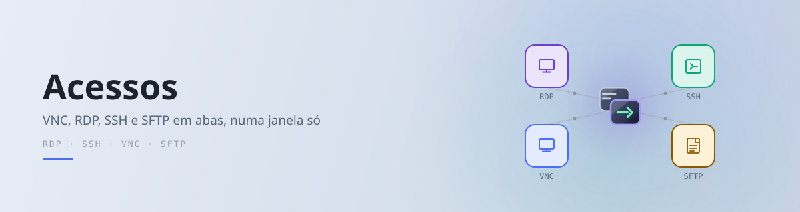

# Disclaimer
Desenvolvido com IA, revisado por mim
  Este repositório utiliza inteligência artificial no processo criativo (vibecoding). No entanto, todo o código é revisado, testado e mantido 100% manualmente por mim, garantindo cuidado em cada detalhe como único mantenedor do projeto (por enquanto).

AI-Assisted, Human-Crafted
  This repository leverages artificial intelligence during the creative process (vibecoding). However, all code is 100% manually reviewed, tested, and maintained by me, ensuring care and quality as a solo maintainer (for now).
  
# Acessos

<picture>
  <source media="(prefers-color-scheme: dark)" srcset="icones/banner-escuro.svg">
  
</picture>

Gerenciador de acesso remoto às máquinas — VNC, RDP, SSH e transferência de
arquivos, em abas.

A partir da **2.0** o aplicativo é escrito em **Go**, com interface
desenhada na GPU. O que ele lê e escreve não mudou: os mesmos
`conexoes.ini`, `chaveiro.ini` e `snippets.ini` de sempre, no mesmo lugar.
Instalar a 2.0 por cima da 1.x não pede migração nenhuma.

## A versão em Python (1.x)

Ela não foi apagada. O código continua acessível de duas formas:

```bash
git checkout v1.2.2     # a última versão publicada em Python
git checkout 1.x        # a linha de manutenção, caso precise de correção
```

`master` segue a versão nova. É o arranjo usual quando um projeto troca de
implementação: a linha antiga vive na sua própria branch e nas tags, sem
uma cópia morta ocupando espaço na árvore atual — cópia duplicada envelhece
sem ninguém perceber e não tem histórico próprio.

## Instalar

```bash
./build.sh --instalar     # constrói o Flatpak e instala para o usuário
```

Depois: pelo menu de aplicativos, ou `flatpak run org.jj.Acessos`.

| Comando | O que faz |
|---|---|
| `./build.sh` | constrói e gera `build/org.jj.Acessos-<versão>.flatpak` |
| `./build.sh --instalar` | constrói, gera o bundle e instala ou atualiza |
| `./build.sh --limpar` | apaga `build/` inteiro |

Para desenvolver sem empacotar, com as bibliotecas do sistema
(`libvncclient`, `freerdp3`, `wayland-client`, `xkbcommon`):

```bash
go build -o acessos ./cmd/acessos && ./acessos
```

Sem argumento ele abre o inventário padrão
(`$XDG_CONFIG_HOME/acessos/conexoes.ini`), criando um exemplo comentado na
primeira execução. `-ini` aponta para outro arquivo.

## Atalho global

`Ctrl+Shift+F12` abre uma caixa de busca pequena por cima do que estiver na
tela, sem precisar ir até a janela do programa: digite parte do nome da
máquina, escolha, e ela abre numa aba nova — com a janela do Acessos vindo
para a frente junto. Máquina que já está aberta troca para a aba dela.

Cada linha traz a mesma fileira de ícones do Painel: clicar no ícone abre
aquele protocolo, `Enter` abre o preferido, `Esc` fecha. Um destino que não
está cadastrado aparece como última linha quando a busca não acha nada.

O atalho vale **com o app fechado**: quem o segura é um processo pequeno e
sem janela (`acessos -servico`), que sobe junto com o app na primeira vez e
continua vivo depois que a janela fecha. Com o app aberto, o atalho pipoca a
caixa nele; com o app fechado, a caixa nasce no serviço e a janela grande só
sobe quando uma máquina for escolhida. Esse mesmo serviço dá **instância
única**: abrir o Acessos de novo manda o pedido para a janela que já existe
em vez de abrir uma segunda (e, antes disso, um aperto de tecla chegava a
abrir duas caixas, uma por instância).

Para o atalho existir logo depois de um login, sem ninguém abrir o app
antes, o serviço pede ao sistema — uma vez só — permissão para subir
sozinho (portal `Background`). A resposta fica gravada em `[geral]
atalho_autostart` no `conexoes.ini` (`1` aceito, `0` recusado); apagar a
chave faz perguntar de novo.

O serviço é um processo separado e proposital: ele NÃO morre junto com a
janela. Para derrubá-lo (ao trocar de versão à mão, por exemplo),
`pkill -f "acessos -servico"`; o socket dele fica em
`$XDG_RUNTIME_DIR/acessos/servico.sock`. Uma versão nova do app pede a
vaga sozinha ao subir, então numa atualização normal não é preciso fazer
nada.

No Linux quem amarra a tecla é o sistema, não o app — é assim que o Wayland
permite atalho global, pelo portal `GlobalShortcuts`. O serviço pede
`Ctrl+Shift+F12`, e o KDE confirma **uma vez só** na primeira execução. Se
esse diálogo for recusado, o atalho fica registrado sem tecla nenhuma e pode
ser amarrado em Preferências do Sistema → Atalhos → Acessos; o app avisa no
terminal quando isso acontece.

No Windows quem amarra a tecla é o próprio app, com `RegisterHotKey`: sem
portal, sem diálogo de confirmação e sem precisar do serviço — não há
sessão para morrer junto com o processo, então o atalho só existe com o
app aberto.

## Windows

O mesmo código-fonte gera o executável e o instalador do Windows, a partir
do Linux, numa passada só:

```bash
scripts/build-windows.sh               # build/win/dist/ (acessos.exe + DLLs)
scripts/build-windows.sh --instalador  # build/win/AcessosSetup-<versão>.exe
scripts/build-windows.sh --limpar      # apaga build/win/
```

Nada precisa ser instalado no sistema e nada pede root: o script monta um
sysroot MinGW com os pacotes binários do MSYS2 (`scripts/sysroot-msys2.py`
— repositório `ucrt64`, a mesma ABI do `mingw-w64-gcc` do Arch), gera o
ícone a partir do mesmo SVG do Linux, compila com cgo (VNC e RDP ligados),
resolve **recursivamente** as DLLs de que o `.exe` depende
(`scripts/dlls-windows.py`) e, no `--instalador`, compila
`scripts/instalador.iss` com o Inno Setup rodando num prefixo Wine próprio,
em `build/win/wine` — o `~/.wine` do usuário fica intocado.

O instalador não pede administrador: instala em
`%LOCALAPPDATA%\Acessos`, com atalho no Menu Iniciar e (opcional) na Área
de Trabalho. O inventário fica em `%APPDATA%\acessos\conexoes.ini`.

Diferenças em relação ao Linux: a sonda de vida usa `IcmpSendEcho` do
`iphlpapi` no lugar do socket ICMP sem privilégio, e o app grava
`log.txt`/`freerdp.log` ao lado do `conexoes.ini` (compilado como
aplicativo gráfico, ele não tem stdout).

Tela, mouse, teclado e área de transferência funcionam nas sessões
remotas do Windows (VNC e RDP testados; SSH usa o mesmo caminho). Layout
de teclado assumido é US — ver limitações no item 1 do
[BACKLOG.md](BACKLOG.md).

## Estrutura

```
cmd/acessos/          a aplicação (interface, abas, diálogos)
internal/
  vnc/ rdp/           clientes próprios, cgo sobre libvncclient e libfreerdp3
  grab/               teclado, área de transferência e inibição de atalhos
                      por Wayland direto
  conexoes/           leitura e gravação cirúrgica do conexoes.ini
  cofre/ chaveiro/    senhas cifradas e credenciais reutilizáveis
  massa/              execução em lote (portado do Mass SSH Executer)
  hostkey/ vida/      identidade do servidor SSH e sonda de vida
scripts/              build para Windows: sysroot MSYS2, DLLs, instalador
third_party/gio/      Gio com três patches — veja PATCH.md
flatpak/              manifesto, .desktop e metainfo
```

Os comandos em `cmd/` que não são `acessos` são ferramentas de teste
manual de cada protocolo, usadas durante o porte.

## Licença

GNU GPLv3 — veja [LICENSE](LICENSE).
